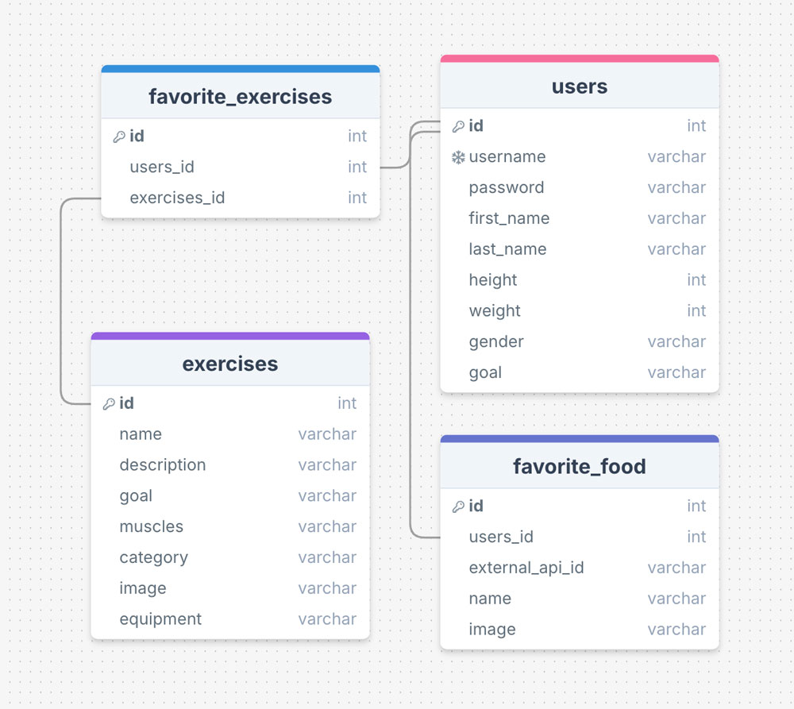

# MyTrainer MVP

This app is here for you to change your life and transform your body and mind to the best possible way.
There is an undeniable relationship between food and exercise. Food provides energy. Exercise burns energy. A good partnership between workouts and balanced diet can stimulate positive body changes. Good nutrition can help boosting any exercising routine by gaining the lean body mass and losing fat. You can check, follow and favorite exercises and search for food recipies and save them for later that will keep you motivated in your journey of long healthy life.

## Database Schema



## Used Technologies

Back-end: MySQL, Node.js/Express

Front-end: JavaScript/ReactJS, CSS3, HTML5

## Prerequisites for back-end to install

//coming soon

## Prerequisites for front-end to install

//coming soon

## Dependencies

- Run `npm install` in the project folder to install dependencies related to Express (the server).
- `cd client` and run `npm install` to install dependencies related to React (the client).

###Dependecies for back-end installation `Node/Express`:
`npm install mysql nodemon dotenv cors jsonwebtoken bcrypt` - will install MySQL, Nodemon, Dotenv CORS and Jsonwebtoken Bcrypt;

###Dependecies for front-end installation `client`:
`npm install react-router-dom axios` - install react router and axios;
`npm install react-youtube` - install Youtube component;

## Database Setup

- Create the database mytrainer in MySQL:
  `CREATE DATABASE mytrainer;`
- Use the provided _init_db.sql_ file to import the initial database tables `npm run migrate` in back end terminal
- Ensure the tables have been correctly created by running the following in MySQL:
  ```
  USE mytrainer;
  SHOW TABLES;
  DESCRIBE users;
  DESCRIBE exerceses;
  DESCRIBE favorite_exerceses;
  DESCRIBE favorite_food;
  ```
- Create the .env file to match your personal credentials:

```
DB_HOST=localhost
DB_USER=yourUser
DB_PASS=yourPassword
DB_NAME=mytrainer
SUPER_SECRET=yourSuperSecret
API_Key=yourKey
```
